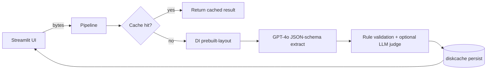

# GenAI Assessment

Production-grade, async Python solution for the KPMG GenAI take-home:

- **Phase 1 (`form_extraction/`)** — OCR + field extraction from Israeli
  National Insurance Institute (ביטוח לאומי) **Form 283** documents using
  Azure Document Intelligence and Azure OpenAI GPT-4o. Includes a Streamlit UI.
- **Phase 2 (`medical_chatbot/`)** — stateless FastAPI microservice + chat UI
  answering questions about medical services for the Israeli health funds.
  _(Scaffolded; implementation pending.)_

Shared infrastructure lives in `common/` so both phases reuse the same Azure
clients, retry policy, structured logging, caching, error hierarchy, and PII
redaction helpers.

## Highlights

- **Native Azure SDKs only** (no LangChain): `azure-ai-documentintelligence` + `openai` AsyncAzureOpenAI.
- **JSON-schema structured outputs** generated from a single Pydantic model — the same schema drives the LLM response format, parsing, UI, and tests.
- **Async end-to-end** with typed errors, `tenacity` retries (exponential + jitter), Azure-specific retry conditions, and per-stage timings.
- **Structured JSON logs** (`structlog`) with a per-request `correlation_id` that spans OCR, extraction, validation, and UI.
- **Persistent disk cache** (`diskcache`) keyed by `sha256(file_bytes)` — re-uploading the same file is instant and free.
- **PII-aware**: file-type/size allow-list on upload; ID numbers, phone numbers, and sensitive payload fields are masked before logging.
- **Bilingual** (Hebrew + English) with a Hebrew-keyed output mode.
- **CI/CD-ready**: GitHub Actions CI (ruff + mypy + pytest), container image build + ACR push, Azure Container Apps deploy via OIDC federated credentials, Dependabot, and pre-commit hooks.

## Project layout

```
common/                    # shared infra (reused by every feature)
  config.py                # pydantic-settings loader
  logging_config.py        # JSON structlog + correlation_id contextvar
  errors.py                # typed exception hierarchy
  security.py              # upload allow-list, PII redaction
  cache.py                 # diskcache wrapper
  clients/
    retry.py               # tenacity AsyncRetrying with Azure-aware predicates
    doc_intelligence.py    # Azure Document Intelligence async wrapper
    openai_client.py       # AsyncAzureOpenAI chat_json wrapper

form_extraction/           # Phase 1
  backend/                 # pipeline library consumed by the UI
    schemas.py             # Pydantic v2 schema + OpenAI JSON-schema builder
    pipeline.py            # async orchestrator (OCR -> extract -> validate)
    ocr/layout.py
    extraction/
    validation/
  frontend/
    streamlit_app.py       # Streamlit UI

medical_chatbot/           # Phase 2 (scaffold)
  backend/                 # FastAPI stateless microservice
  frontend/                # Streamlit/Gradio chat client

tests/
  common/                  # shared-infra tests
  form_extraction/         # Phase 1 tests (+ golden JSONs, integration gated)

.github/workflows/         # CI + deploy pipelines
Dockerfile                 # multi-stage image for the Streamlit UI
.pre-commit-config.yaml    # ruff check + ruff format hooks
.github/dependabot.yml     # pip + GitHub Actions updates
```

## Data flow (Phase 1)



## Setup

Requires Python 3.11+.

```bash
make install        # creates .venv and installs project + dev deps
cp .env.example .env
# edit .env and paste your Azure credentials (see below)
```

Required `.env` keys (see [`.env.example`](.env.example)):

| variable | purpose |
| --- | --- |
| `AZURE_DOC_INTELLIGENCE_ENDPOINT` / `AZURE_DOC_INTELLIGENCE_KEY` | Azure AI Document Intelligence resource |
| `AZURE_OPENAI_ENDPOINT` / `AZURE_OPENAI_KEY` | Azure OpenAI resource |
| `AZURE_OPENAI_DEPLOYMENT_EXTRACT` | GPT-4o deployment name (default: `gpt-4o`) |
| `AZURE_OPENAI_DEPLOYMENT_JUDGE` | GPT-4o-mini deployment (only if judge enabled) |
| `AZURE_OPENAI_DEPLOYMENT_CHAT` | GPT-4o deployment used by Phase 2 |
| `AZURE_OPENAI_DEPLOYMENT_EMBEDDING` | `text-embedding-ada-002` deployment (Phase 2) |
| `APP_ENABLE_LLM_JUDGE` | `true` to run the optional faithfulness judge |

## Run

```bash
make run            # starts Streamlit on http://localhost:8501
# or, containerized:
make docker-build
make docker-run     # reads .env
```

The UI tabs show the extracted JSON, a validation report (completeness, error
and warning counts, per-field issues, optional LLM-judge score), a brief OCR
summary, and per-stage timings with cache hit indicators.

## Test, lint, type-check

```bash
make test           # unit tests (no Azure required)
make lint           # ruff
make typecheck      # mypy (strict)
make format         # ruff check --fix + ruff format
```

Integration tests against live Azure are opt-in:

```bash
make test-integration                          # == RUN_AZURE_TESTS=1 pytest
UPDATE_GOLDEN=1 make test-integration          # refresh golden JSONs
```

Override the sample-data location with `PHASE1_DATA_DIR=/path/to/phase1_data`.

## CI/CD

### Continuous integration — [`.github/workflows/ci.yml`](.github/workflows/ci.yml)

On every PR and push to `main`:

- matrix over Python 3.11 / 3.12;
- install project + dev extras;
- `ruff check`, `ruff format --check`, `mypy` (strict), `pytest` (unit only);
- upload coverage artifact.

Secrets are never required — the Azure-backed integration suite is skipped
unless `RUN_AZURE_TESTS=1` is set by a maintainer re-running the workflow.

### Deploy to Azure — [`.github/workflows/deploy.yml`](.github/workflows/deploy.yml)

Triggers on pushes to `main` (or manual `workflow_dispatch`). Uses GitHub OIDC
federated credentials (no long-lived `AZURE_CREDENTIALS` secret):

1. `azure/login@v2` via `azure/login` action with federated credentials.
2. Build multi-stage image from the root [`Dockerfile`](Dockerfile).
3. Push to Azure Container Registry (`ACR_NAME`).
4. `az containerapp update` against an existing Container App (`CONTAINER_APP_NAME`) in the configured `RESOURCE_GROUP`.

### Repository secrets / variables the deploy job expects

| key | scope | description |
| --- | --- | --- |
| `AZURE_TENANT_ID` | variable | Entra tenant |
| `AZURE_SUBSCRIPTION_ID` | variable | target subscription |
| `AZURE_CLIENT_ID` | variable | app registration with federated credential for this repo |
| `ACR_NAME` | variable | Azure Container Registry (e.g. `kpmggenai.azurecr.io`) |
| `RESOURCE_GROUP` | variable | resource group holding the Container App |
| `CONTAINER_APP_NAME` | variable | target Container App |
| Azure Key Vault references | via Container App | provide `AZURE_*` runtime secrets to the container |

### Hardening checklist for production

- Store all runtime secrets (`AZURE_OPENAI_KEY`, `AZURE_DOC_INTELLIGENCE_KEY`)
  in **Azure Key Vault** and inject them into the Container App via secret
  references — never in workflow secrets or image layers.
- Use a **managed identity** on the Container App for Key Vault access.
- Configure **Application Insights** / OpenTelemetry exporter in front of the
  existing `structlog` JSON logs for distributed tracing.
- Add `/healthz` and `/readyz` endpoints to the Phase 2 FastAPI service for
  Container Apps liveness/readiness probes.
- Enforce branch protection on `main`, require CI green + review before merge.

## Engineering notes

### Single-source schema & structured outputs

`build_extraction_json_schema()` in [`form_extraction/backend/schemas.py`](form_extraction/backend/schemas.py)
normalises the Pydantic schema to Azure OpenAI's strict mode (adds
`additionalProperties: false`, marks every property as `required`, drops
`default`/`title` keywords). The LLM is forced to return the exact shape,
which eliminates almost all parse/shape errors. On the rare Pydantic
validation failure, the extractor issues **one** corrective re-ask with the
error message appended to the conversation.

### Retries

`common/clients/retry.py` builds a `tenacity.AsyncRetrying` policy:

- `stop_after_attempt(5)`, `wait_exponential_jitter(initial=0.5, max=20)`.
- Retries only on `APITimeoutError`, `APIConnectionError`, `RateLimitError`, `InternalServerError`, Azure `ServiceRequestError`, `ServiceResponseError`, and 5xx `HttpResponseError`.
- 4xx (auth, bad request) fail fast and surface as typed `AzureAuthError` / `ExtractionError`.

Every retry logs a structured `azure.retry` event with the attempt number and
next sleep duration.

### Logging & observability

`logging_config.py` configures `structlog` to emit JSON to stderr with ISO
timestamps, log level, and a `correlation_id` injected from a `ContextVar`.
The pipeline wraps each request in `correlation_scope()` so every log line
emitted by OCR, LLM calls, validation, and the UI shares the same ID.

Per-call OpenAI logs include deployment, duration, prompt/completion/total
tokens, and finish reason. Per-OCR logs include page count and content size.

### Security

- Uploads are sniffed via magic bytes + filename extension; only PDF / JPEG / PNG pass.
- Size cap (`APP_MAX_UPLOAD_MB`, default 10 MB).
- Azure keys are held in `SecretStr`; they are never logged or echoed.
- `security.redact_payload()` masks ID numbers and phone-like fields before any sensitive payload is logged.
- `.env` is git-ignored; `.env.example` is the documented template.

### Caching

`common/cache.py` wraps `diskcache.Cache` under `APP_CACHE_DIR` (default
`.cache/`). Keys are `"<stage>:<sha256>"` so OCR, extraction, and embedding
results coexist per file. TTL defaults to 30 days. Re-uploading the same
bytes completes in milliseconds and is marked clearly in the UI "Timings"
tab.

## Roadmap to Phase 2

Phase 2 will add (under `medical_chatbot/`):

- `backend/main.py` — FastAPI app with `/chat/collect`, `/chat/qa`, `/healthz`, `/readyz`.
- `backend/knowledge_base/` — HTML chunker + retriever over `phase2_data/*.html`.
- `frontend/streamlit_app.py` — bilingual chat UI that keeps all user + conversation state client-side.
- Separate `Dockerfile.backend` and `Dockerfile.frontend` (or a multi-service compose).
- CI job extending the deploy workflow with a second Container App target.
